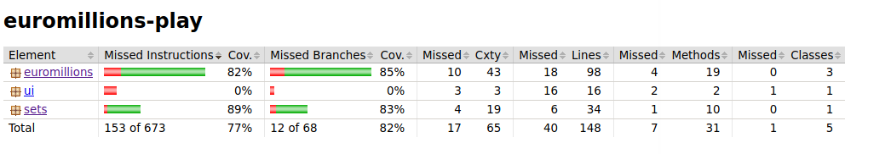
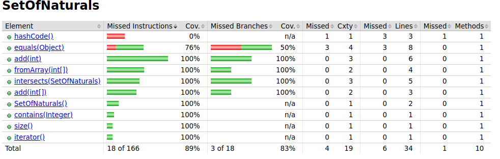

2a) We need to do the necessary tests to Class Dip and all necessary changes into the Class

Changes made in class Dip:
    - In the constructor i did the verification if the numbers and stars are between their bounds (e.g A number can not be greather than 50 and less then or equal 0: A star can not be greater than 10 and less or equal than 0)
    - In method format the format of the stars being printed we can see in the tests that are expect to be the same as the numbers. Change %d to %3d
    - Magic numbers erased which be talked in 2c)

Changes made in the tests:
    - Changing the test "testConstructorFromBadArrays()" which will verify if the number of any of the arrays (numbers or stars) is with the incorrect size (Must be 5 numbers and 2 stars)

Notes:
@Test defines a test method
@BeforeEache Runs before each test
@DisplayName is the name of the test to be displayed
@AssertX Depending on the X it does different things. But it asserts the statement in a certain way e.q equals to something, or is true, false, expection a Exception

2b) Changes to class Set of Naturals Class and Test

A set of naturals isn't necessarily a class to this Euromillion problem. It works more like a Java library that can be used across multiple projects.

Notes: The class SetOfNaturals represents a set (no duplicates should be allowed) ofintegers,in the range [1, +∞].Some basic operations are available (add element, find the intersection...).

Changes made in Class SetOfNaturals:
    - Creation of method intersects that verifies if a subset intersects the current set. This is done by verifying if any numbers of the subset is present at the current set
      Returns true in case there is, and false in case there isn't

Changes made in tests (Will enumerate just a few of them -> Check them out in the code that it is easiear and more self-explanatory):
    - Verifying if we are adding duplicate or negative(or zero) number(s) to a set (From 3 different sources -> FromArray which transforms an array into a set
                                                                                                             -> Single number being added
                                                                                                             -> Adding an array to an existing set)
    - Test the false-positives and positives-falses for intersection, i.e verifying if there is a intersection and the result is that it isn't and vice-versa
    - Same thing for method contains
    - Testing size after and addition to the set being it from 3 different sources

    This is very resumed, but check the code out ( I think the code is very self-explanatory)
    
2c) Talked in 2a) -> Refactoring of the code to eliminate "Magic Numbers". Check what Magic Numbers are : https://refactoring.guru/replace-magic-number-with-symbolic-constant
    Creation of this constants to be used troughout the class:
        static int MAX_NUMBERS = 50;
        static int MIN_NUMBERS = 0;
        static int MAX_STARS = 10;
        static int MIN_STARS = 0;
        static int ARRAY_SIZE_NUMBERS = 5;
        static int ARRAY_SIZE_STARS = 2;

2d) Use Jacoco : https://www.baeldung.com/jacoco to get analysis -> This link has got a tutorial on how to set your project to get Jacoco running in your project.

After following this tutorial you should run mvn test jacoco:report
This command is necessary to see if jacoco was executed, and jacoc needs the results of the test so he can do the analysis of the coverage of the code.
To see the results head up to folder target (local where maven puts the output of the build), then folder site then jacoc and then open index.html in the browser you wish.
When we open up the website we can see the analysis made by jacoco.

We can see the analysis that jacoco executed in the unit tests of this project. An important note is that jacoco doesn't verify if the tests failed or not, he looks only to the total code of the project and the code that was used to execute the tests and gives feedback about this coverage.
There are 2 differents coverage, one in the instructions that can be almost called the lines, and then branches which are instructions like switch, if, cicles, i.e "paths".-

Opening up SetOfNaturals, we can see the coverage in each method. But there is something strange. The coverage on hashCode() and equals() are not 100% so should we be worried about that? Should we make more tests to get coverage 100%? This questions leads us to the assignment question.

# Which classes/methods offer less coverage? Are all possible decision branches being covered?

We can see in the image above that not all methods offers us coverage 100% but we shouldn't be concerned about that. The truth is that generally speaking, the methods that are generated by the IDE or framework (in this case method equals and method hashcode) don't need to be tested. We can trust on the code pre made by the framework. But that was generally speaking. We need to take in consideration another aspects. For instance, if we changed some logic in that code, being that the code is now "ours" we need to test it.

From this we can conclude that coverage is very important so we can trust the code, but it is not an absolute trusted measure. Coverage needs to be analysed as well and i will explain why. Imagine that we have a certain method and we need to do 2 tests in it. If we do only test1, the coverage will be 100% because all the lines will be executed, however we didn't test all things necessary. This is a bit dubious so we need to take special attention and we can't fully trust coverage.

## Note: This is are the results of tests Dip using Jacoco.
