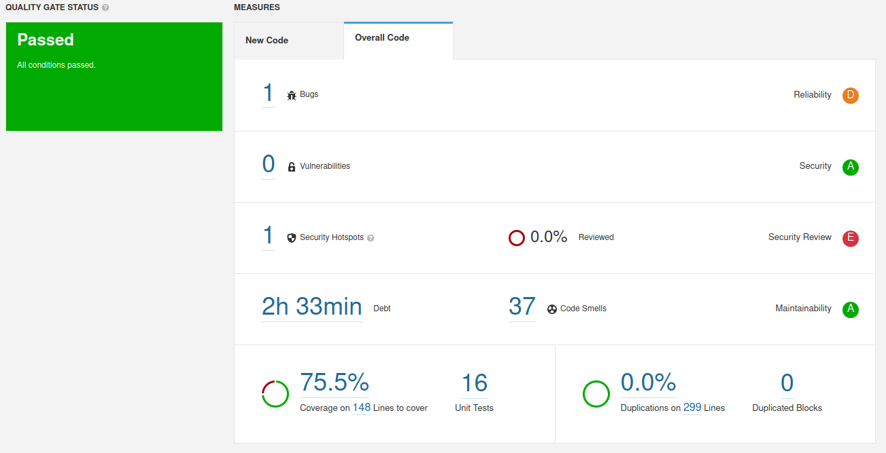

# 1

## Notes:
    In this class we will use SonarQube who gives the opportunity to test static code quality and gives feedback about quality metrics on the codebase. There metrics are based on the occurrence of know weaknesses, a.k.a "code smells". In this kind of analysis, the solution is not deployed, nor the code is not executed (thus the name static analysis). Key measures include the occurrence of problems likely to produce errors, vulnerabilities (security/reliability concerns) and code smells (bad/poor practice or coding style); coverage (ratio tested/total); and code complexity assessment. 

    To install sonarQube go to this link and follow tutorial: https://docs.sonarqube.org/latest/setup/get-started-2-minutes/
    Install from the docker image : docker run -d --name sonarqube -e SONAR_ES_BOOTSTRAP_CHECKS_DISABLE=true -p 9000:9000 sonarqube:latest

    But have special attention because portainer usually runs on the same port.

    If you want a production databse check this link: https://github.com/naveenanimation20/MayPOMFramework/blob/master/src/test/resources/docker-compose.yml

    Next we need to configure sonar Scanner for maven. For that head up to this link and follow the tutorial.
        To check maven home do: mvn -X
        and then go to /conf/settings.xml and do the necessary changes that are in the tutorial. Note: Change host.url for http://127.0.0.1:9000

    Next we need to generate a token.
    FOr that go to this tutorial: https://docs.sonarqube.org/latest/user-guide/user-token/

    This is in the localhost:9000

    Token copied : 146824c807a05eb44db9946b7ae4f6d76dbd7eba

    THen run this command: mvn clean verify sonar:sonar -Dsonar.login=146824c807a05eb44db9946b7ae4f6d76dbd7eba inside the project u would like to use sonar

    I used in exercise 2 of lab1

    Head up now to sonar Qube dashboard in localhost:9000 and see the results.

## Answers

We can see the results obtained in the following image:

Issue | Problem Description | How to Solve |
--- | --- | --- | 
Bug |  Save and re-use "Random". Creating a new Random object each time a random value is needed is inefficient and may produce numbers which are not random depending on the JDK.| Create a single random and store it | 
Vulnerability | --- | --- |
Code smell (major) | Using System.err or System.out | Use logger |
Security Hotspots | Using pseudorandom number generators (PRNGs) is security-sensitive | Use a cryptographically strong random number generator (RNG) like "java.security.SecureRandom" in place of this PRNG. Use the generated random values only once. You should not expose the generated random value. If you have to store it, make sure that the database or file is secure. |

# 2

For this exercise we will use project Euromillions again.

## a) Take note of the technical debt found. Explain what this value means.
When running euromillions project it was found a debt of 2h33min. This value is an estimative of how much time we have to spend to fix all Maintainability Issues and code smells.

## b) Analyze the reported problems and be sure to correct the severe code smells reported (critical and major).
We seen in exercise 1 the major code smells we had in the code

The first one to resolve is in the class Dip. We were doing an increase in i inside the loop and not using the java correctly. To fix this, just put in the line for(...; i++) instead of inside the loop

The other is inside DemoMain where we are using System.println() instead of a logger. 

## c) Code coverage reports require an additional plugin. Be sure to use a project with unit tests and configured code coverage (e.g.: add the jacoco plugin to maven). You may have already did it in Lab 2.

This step was already done in lab 2.

## d) Run the static analysis and observe/explore the coverage values on the SonarQube dashboard.How many lines are “uncovered”? And how many conditions?

There are 40 Uncovered Lines and 13 Uncovered Conditions. We already discussed this values in Lab 2, but this lines and conditions are missing mainly because they are code that IDE done therefore not needing any tests to run in them. That would be overkill but for better information check Lab2.

