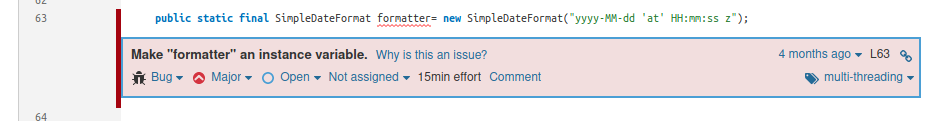
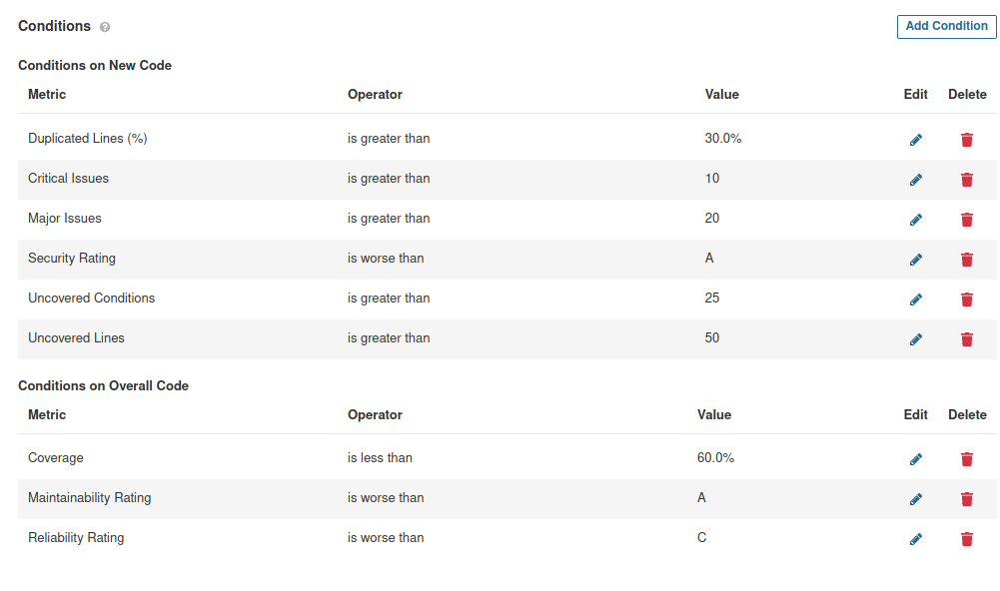

# 1

## Notes:
    In this class we will use SonarQube who gives the opportunity to test static code quality and gives feedback about quality metrics on the codebase. There metrics are based on the occurrence of know weaknesses, a.k.a "code smells". In this kind of analysis, the solution is not deployed, nor the code is not executed (thus the name static analysis). Key measures include the occurrence of problems likely to produce errors, vulnerabilities (security/reliability concerns) and code smells (bad/poor practice or coding style); coverage (ratio tested/total); and code complexity assessment. 

    To install sonarQube go to this link and follow tutorial: https://docs.sonarqube.org/latest/setup/get-started-2-minutes/
    Install from the docker image : docker run -d --name sonarqube -e SONAR_ES_BOOTSTRAP_CHECKS_DISABLE=true -p 9000:9000 sonarqube:latest

    But have special attention because portainer usually runs on the same port.

    If you want a production databse check this link: https://github.com/naveenanimation20/MayPOMFramework/blob/master/src/test/resources/docker-compose.yml

    Next we need to configure sonar Scanner for maven. For that head up to this link and follow the tutorial.
        To check maven home do: mvn -X
        and then go to /conf/settings.xml and do the necessary changes that are in the tutorial. Note: Change host.url for http://127.0.0.1:9000

    Next we need to generate a token.
    FOr that go to this tutorial: https://docs.sonarqube.org/latest/user-guide/user-token/

    This is in the localhost:9000

    Token copied : 146824c807a05eb44db9946b7ae4f6d76dbd7eba

    THen run this command: mvn clean verify sonar:sonar -Dsonar.login=146824c807a05eb44db9946b7ae4f6d76dbd7eba inside the project u would like to use sonar

    I used in exercise 2 of lab1

    Head up now to sonar Qube dashboard in localhost:9000 and see the results.

## Answers

We can see the results obtained in the following image:

Issue | Problem Description | How to Solve |
--- | --- | --- | 
Bug |  Save and re-use "Random". Creating a new Random object each time a random value is needed is inefficient and may produce numbers which are not random depending on the JDK.| Create a single random and store it | 
Vulnerability | --- | --- |
Code smell (major) | Using System.err or System.out | Use logger |
Security Hotspots | Using pseudorandom number generators (PRNGs) is security-sensitive | Use a cryptographically strong random number generator (RNG) like "java.security.SecureRandom" in place of this PRNG. Use the generated random values only once. You should not expose the generated random value. If you have to store it, make sure that the database or file is secure. |

# 2

For this exercise we will use project Euromillions again.

## a) Take note of the technical debt found. Explain what this value means.
When running euromillions project it was found a debt of 2h33min. This value is an estimative of how much time we have to spend to fix all Maintainability Issues and code smells.

## b) Analyze the reported problems and be sure to correct the severe code smells reported (critical and major).
We seen in exercise 1 the major code smells we had in the code

The first one to resolve is in the class Dip. We were doing an increase in i inside the loop and not using the java correctly. To fix this, just put in the line for(...; i++) instead of inside the loop

The other is inside DemoMain where we are using System.println() instead of a logger. 

After updating the problems solved and heading into sonar qube I checked that the quality gate did not meet the requirements and new 3 major code smells were introduced.
It said that methods should be invoked only conditionally.

After fixing that, and running the default quality gates the tests failed. This happened because the coverage on new lines was not greater than 80%. In d) it is explained why this coverage is low, and so i created a custom quality gate to this case.

## c) Code coverage reports require an additional plugin. Be sure to use a project with unit tests and configured code coverage (e.g.: add the jacoco plugin to maven). You may have already did it in Lab 2.

This step was already done in lab 2.

## d) Run the static analysis and observe/explore the coverage values on the SonarQube dashboard.How many lines are “uncovered”? And how many conditions?

There are 40 Uncovered Lines and 13 Uncovered Conditions. We already discussed this values in Lab 2, but this lines and conditions are missing mainly because they are code that IDE done therefore not needing any tests to run in them. That would be overkill but for better information check Lab2.

# 3

For this exercise we will check last semester work done in IES. 

First thing to do is generate a token to get the project into sonar qube.

Follow the steps in exercise 1.

Token: 4a038b1cc99fe2889f28f158b6b9eb18765df35e

We got this command following the steps of adding a project mannualy

Command to execute: mvn sonar:sonar \
    -Dsonar.projectKey=ies_project \
    -Dsonar.host.url=http://127.0.0.1:9000 \
    -Dsonar.login=4a038b1cc99fe2889f28f158b6b9eb18765df35e

When we head up to localhost:9000 and click on the project we just analyzed we see the following content:

## Bugs
We can see here that we have one bug. 

This bug appears because we used a java library SimpleDateFormat with static. Not all java libraries were written to be thread-safe so this can lead into problems.

## Vulnerabilities
We also have a critical vulnerability

This appears because we are using passwordEncoder in plain-text. Password should be stored in a hash using a secure algorithm preventing brute force attacks, collision attacks as well as adding a salt to lower the risk of rainbow table attacks.

## Other reviews

We can see also that we have got 7 security hotspots that needed to be reviewed to check if there was any risk associated with it.

In this project because it was out of context, it weren't implemented any security hotsots review as well as code review. There isn't any code coverage as well.

The duplication is high, but after reviewed we saw that the major of it was associated with simillar lines but no exactly equal, as well as them having different functionalities so we concluded that this is not 100% accurate and we have to take in consideration that for big projects like this one.

## a) Quality Gates
After all of this was reviewed we defined the following quality gates that we think are recommended to simillar projects.

Briefly explaining them:

On global code:
- Duplicated lines we put an higher percentage than the default because after reviewing the code we saw that the major of duplication was not really duplication but simillar code
- Security rating must be A because that is a critical part of a system
- Coverage must be higher than 60% because the truth is coverage values trend to be low because it is not necessary to run tests in code produced by the IDE. We think 60% is a reasonable value between preventing a lot of code to not be covered and not being necessary to do tests on code that IDE produces.
- Maintanability Rating must be A. We though of this because we got 310 code smells, with some critical and major issues and our rating still get A. This means that getting an A here is not as difficult and it pays off to do good practices in coding.
- Realiability rating must be at least C. This due to in our case we have a bug seen above that is not as critical, and so in other projects similar cases might happen and we don't think its fair not passing just because of a bug like this. 

On new code:
- Critical Issues higher than 10 because using an agile approach we are supposed to do small commits and so if they have got more than 10 issues that might be a problem
- Major Issues higher than 20 the same reason as before, in this case major are not as problematic so we allow some more
- Uncovered Conditions and Lines greater than 25 and 50 respectively due to the major of this problem being associated with automated code the IDE produces, so we allow a values that might be higher than what is expected.

Quality Gates are just metric and all the code must be reviewd. They are a huge help but not the final decision on wether a app is excellent or not.