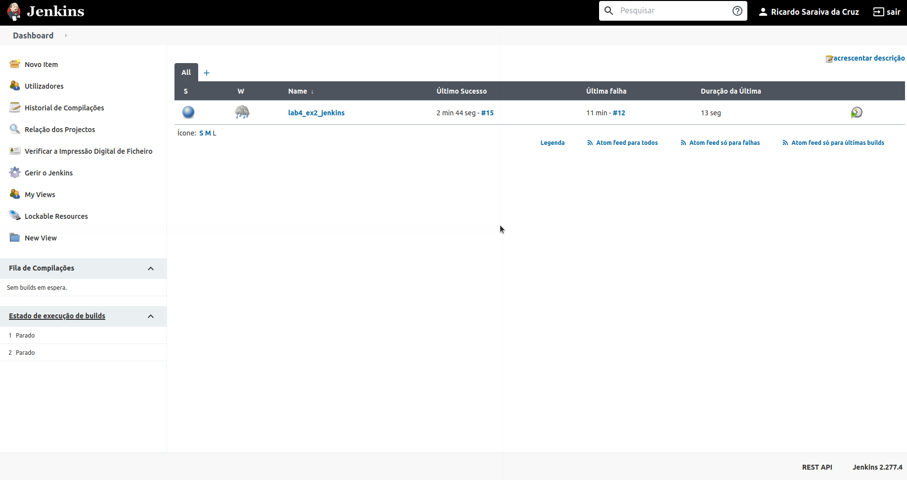
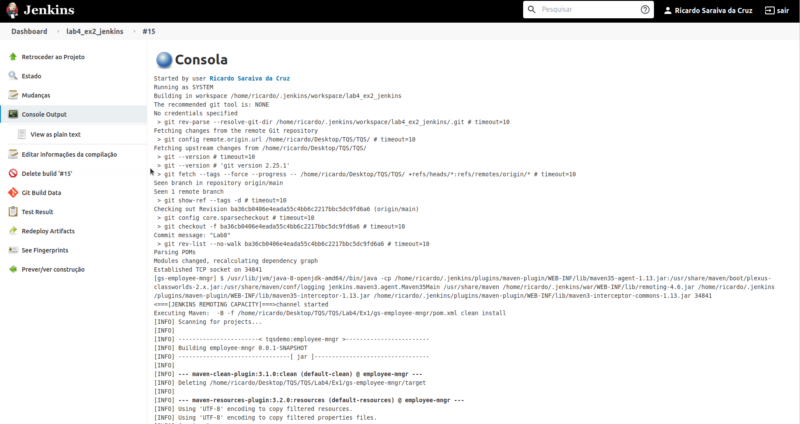
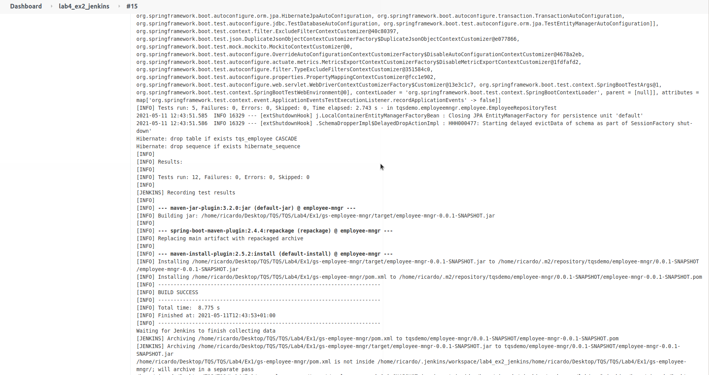
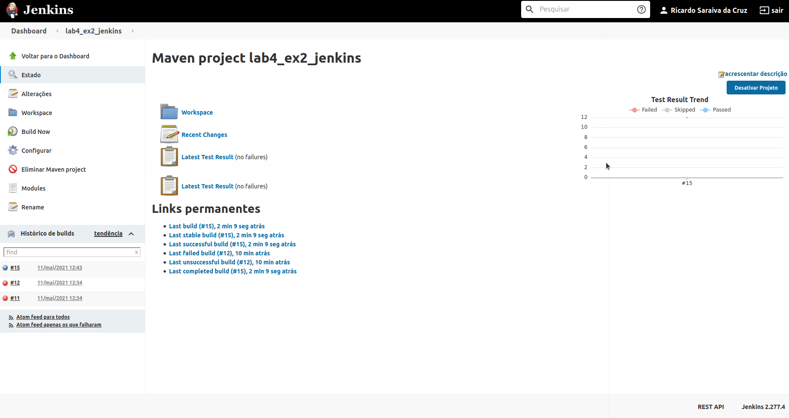
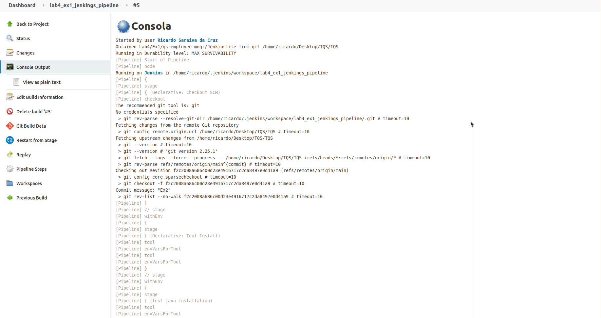
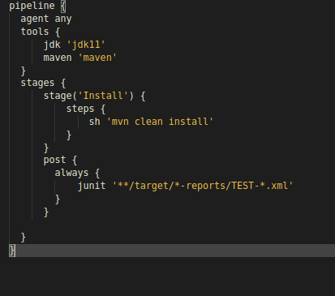
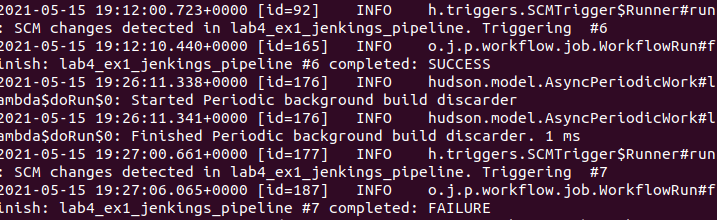

# Jenkins

For this class, the objective was to do a small introduction to jenkins, using locally and with docker. Unfortunately I was not able to do neither exercise 3 neither 4 due to the lack of space in the disk and lack of the time beucase of mid assignment.

To start jenkins : Download .war file

Run this command on terminal: java -jar jenkins.war --httpPort=8080

It should be available at : http://localhost:8080

Below there are some prints relative to exercise 1 and 2

# Exercise 1 -> For this exercise i Used lab_4_ex2

# Exercise 2 -> For this exercise i Used lab_4_ex1

## After adding H / 15 * * * in scm -> We can see that every 15 minutes it tries to run jenkinsfile and do what is especified

# Unfortunatly like i've said before, i was not able to do exercise 3 and 4 due to the lack of space in the disk and time.
